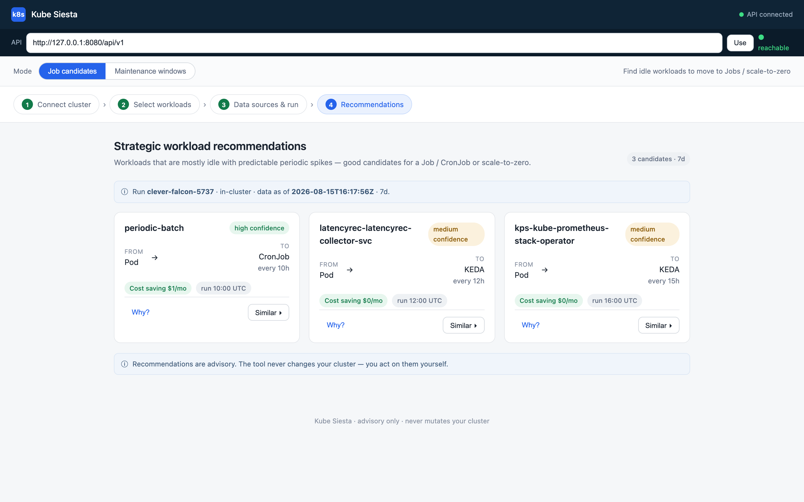
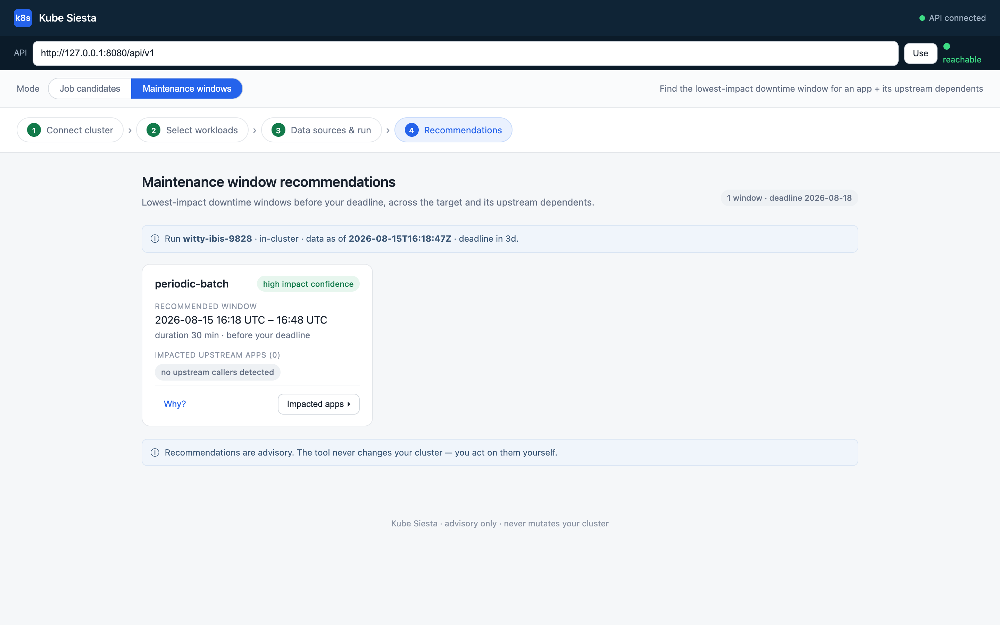

# Kube Siesta

**Find the Kubernetes workloads that are asleep and stop paying for them.**

Many Kubernetes workloads spend more time idle than working. A batch job that
runs 15 minutes every 4 hours still holds its pod (and its bill) for the other
3h 45m. A dependency service peaks at 3 PM and sits at 5% CPU for the rest of
the day. Kube Siesta is a tool that _looks_ at your metrics and _tells_ you 
which workloads are like this — and when's the safe time to schedule them, 
migrate them, or take them down — pays for itself immediately. Derived from
the word "Siesta" - a short sleep or rest.

Kube Siesta reads your existing data (currently Prometheus) and gives you two 
kinds of advice:

1. **Job candidates** — _"This deployment is idle 87% of the day and spikes for
   2h every 8h. Turn it into a CronJob. You'll save ~$32/mo."_
2. **Maintenance windows** — _"For your `payments` service, `Tue 03:00–03:30
   UTC` is the lowest-impact 30-minute slot before your Friday deadline — all
   its upstream callers are idle then too."_

**It never touches your cluster.** Read-only credentials, no mutating admission
webhooks, no operator. Just advice.

<p align="center">
  
</p>

## Two features, one analysis pipeline

Both recommenders share the same seven-stage engine that recovers a workload's
active/idle rhythm from its metrics. The job head then filters for
migration candidates and picks a target tier (Job / CronJob / KEDA / Knative);
the maintenance head projects those rhythms forward, sums across the target
plus its upstream callers, and slides a window to find the earliest low-impact
slot before your deadline.

### Job candidates

For each workload:

- Are its CPU and memory both idle most of the time?
- Do they spike **together**, on a predictable cycle?
- Is the residual baseline low enough to stop the pod between spikes?

If yes, it's a candidate. Kube Siesta names a target (`Job` for one-shot,
`CronJob` for repeating, `KEDA` for scale-to-zero with sporadic traffic,
`Knative` for request-driven) and estimates the monthly savings.

**Example output:**

```
vmw-costing1   Pod → CronJob   every 8h at 10:00 UTC, runs ~2h   saves ~$32/mo   (high confidence)
  "CPU spikes ~900% for 2h every 8h; idle otherwise. memory aligns (overlap 100%)."
```

### Maintenance windows

You give it a target workload, a downtime duration, and a deadline. It:

1. **Walks the upstream graph** — every service that calls the target,
   directly or transitively.
2. **Projects everyone's active/idle mask forward** to the deadline, using a
   swappable `Forecaster` (seasonal-naive ships as the default).
3. **Scores every future instant** by the number of workloads projected active
   at that moment.
4. **Slides a window** of the requested length and returns the earliest slot
   with the lowest sum.

Aperiodic callers (no detected cycle or no metric data) are pessimistically
projected as always-active so the window doesn't get chosen under an
unpredictable dependency. Every card surfaces which callers took that path.

<p align="center">
  
</p>

## Try it in 5 minutes (no cluster needed)

The engine ships a synthetic-cluster generator, so you can go from zero to
recommendations without a Kubernetes cluster or Prometheus:

```bash
# Engine — install
cd engine
python3 -m venv .venv && ./.venv/bin/pip install -e ".[dev]"

# 1) generate a synthetic cluster and seed it into ./demo.db
./.venv/bin/python -m engine.cli synth --format csv --out ./fixtures \
    --seed-db --db-dsn ./demo.db

# 2) job recommendations
./.venv/bin/python -m engine.cli run --cluster synth --db-dsn ./demo.db

# 3) maintenance recommendation for one of the synth candidates
./.venv/bin/python -m engine.cli run --type maintenance \
    --cluster synth --app vmw-costing/Deployment/vmw-costing1 \
    --duration 30m --deadline 3d --db-dsn ./demo.db

# 4) serve the API + UI, then walk the wizard at http://localhost:8000/
JOBREC_UI_DIR=../ui ./.venv/bin/python -m engine.cli serve \
    --db-dsn ./demo.db --port 8000
```

Detailed walkthrough: [**docs/quickstart.md**](docs/quickstart.md).

## Deploy to Kubernetes

Per-module images and a Helm chart that runs the collector CronJob, engine
+ API, UI, and an optional bundled Postgres:

```bash
docker build -t kubesiesta/collector:0.1.0 collector/
docker build -t kubesiesta/engine:0.1.0    engine/
docker build -t kubesiesta/ui:0.1.0        ui/
helm install ks deploy/helm/kubesiesta -n kubesiesta --create-namespace \
  --set collector.promUrl=http://prometheus.monitoring:9090
kubectl -n kubesiesta port-forward svc/ks-kubesiesta-ui 8080:80
# open http://localhost:8080/
```

Full guide (external DB, ingress, kind/minikube demo, RBAC): [**docs/deployment.md**](docs/deployment.md).

## Prerequisites

- **Go ≥ 1.23** (to build the collector) and **Python ≥ 3.9** (to run the engine).
- No Kubernetes cluster is needed to try it — the engine ships a synthetic
  generator and uses SQLite by default. Postgres is supported for production.

## Deeper reading

- [**Quickstart**](docs/quickstart.md) — the 5-minute walk-through, with the full
  synthetic → analyze → serve → API loop.
- [**Deployment guide**](docs/deployment.md) — Helm chart, kind/minikube demo,
  ingress, external Postgres, RBAC.
- [**Architecture**](docs/architecture.md) — the shared analysis core, the two
  recommender heads, the state-DB contract, and how the collector fits in.
- [**REST API reference**](docs/api.md) — full `/api/v1` surface for both features.
- [**Maintenance windows deep dive**](docs/maintenance-windows.md) — the
  upstream-DAG traversal, the `Forecaster` interface, the aperiodic-pessimism
  trade-off, and the sliding-window algorithm.
- [**Contributing**](docs/contributing.md) — how to run tests, layout the change,
  and open a PR.

Module-level docs: [`collector/`](collector/README.md), [`engine/`](engine/README.md),
[`ui/`](ui/README.md), [`deploy/`](deploy/README.md).

<details>
<summary><b>REST API — quick reference</b></summary>

Base path `/api/v1` (served by `engine serve`):

| Method | Path | What it does |
|---|---|---|
| `POST` | `/runs` | start a run: `{cluster, scope, config?, ttl?, run_type?, maintenance?}` → `{run_id, name, status}`. `run_type` defaults to `"job"`; `"maintenance"` also requires `maintenance:{target_workload_uid, duration, deadline}` |
| `GET`  | `/runs` | run history (each entry surfaces `run_type`) |
| `GET`  | `/runs/{id}` | run status, freshness (`data_as_of`, `stale`, `run_type`) |
| `GET`  | `/runs/{id}/recommendations` | recommendation cards — shape depends on `run_type` |
| `GET`  | `/runs/{id}/recommendations/{recId}/evidence` | the "why": metrics + chart series + peers (job) or impacted apps + forecast (maintenance). Add `?series=false` for text only |
| `GET/POST/DELETE` | `/clusters`, `/clusters/{id}` | manage connected clusters |
| `POST` | `/clusters:test`, `/clusters/{id}:test` | live cluster connectivity probe (kubeconfig / SA token / client cert / basic auth) |
| `GET`  | `/clusters/{id}/namespaces`, `.../workloads` | browse discovered workloads (from cache) |
| `GET/POST/PUT/DELETE` | `/clusters/{id}/sources`, `/sources/{id}` | manage metric sources |
| `GET/PUT` | `/settings` | default thresholds and data-retention windows |
| `POST/GET` | `/collections`, `/collections/{id}` | trigger + poll on-demand collection |

Full reference with DTOs, request bodies, and error shapes: [**docs/api.md**](docs/api.md).

</details>

## Status

**Working today** (verified end-to-end on a local 3-node kind cluster):

- Collector's Prometheus metrics path.
- Full shared analysis core (prepare / periodicity / seasonality / active-idle
  / aggregate / interaction-graph utilities) across CPU, memory, network, and disk.
- **Job recommender**: cross-resource aggregation, tiered target heuristic,
  cost + savings, deterministic "why" + chart series, dependency-aware peer
  suggestions.
- **Maintenance recommender**: upstream dependency-DAG traversal,
  seasonal-naive forecasting to a user-supplied deadline (behind a swappable
  `Forecaster` interface), per-instant scoring, sliding-window minimization,
  impacted-app list.
- Synthetic-data generator, complete `/api/v1` surface with `run_type` dispatch,
  and a static web UI with a Job ↔ Maintenance mode toggle.
- Live cluster connectivity probe (`/clusters:test`) — kubeconfig, SA token,
  client cert, and basic auth, resolved via k8s Secrets referenced from the DB.
- On-demand (API-triggered) collection via the collector's trigger service.
- Container images + a Helm chart for Kubernetes.

**Not built yet:**
- Live discovery refresh — querying a connected cluster's Kubernetes API to
  list namespaces / workloads on demand (needs the Kubernetes client wired
  through the discovery endpoints).
- Collector's interactions step — the schema exists and the engine already
  consumes it (both for job peers and maintenance upstream traversal), but
  the collector's step to populate it from a service mesh isn't wired yet.
- Holt-Winters / SARIMA forecasters — seasonal-naive ships as the default; the
  `Forecaster` interface is designed for these to drop in.

## Contributing

Bug reports and PRs welcome — see [**docs/contributing.md**](docs/contributing.md) for
the mechanics. Two things to keep an eye on:

- **Tests stay green.** Engine: `cd engine && ./.venv/bin/pytest`. Collector:
  `cd collector && go test ./...`.
- **Contracts.** The database schema is the only cross-module contract — see
  the `collector/internal/store/migrations/` files. `/api/v1` DTOs are the
  other contract; keep them stable across the job and maintenance heads.

## License

MIT — see [`LICENSE`](LICENSE). Permissive: commercial use, private forks,
SaaS hosting, and academic/research use are all allowed. Downstream users must
keep the copyright notice and the license text.
